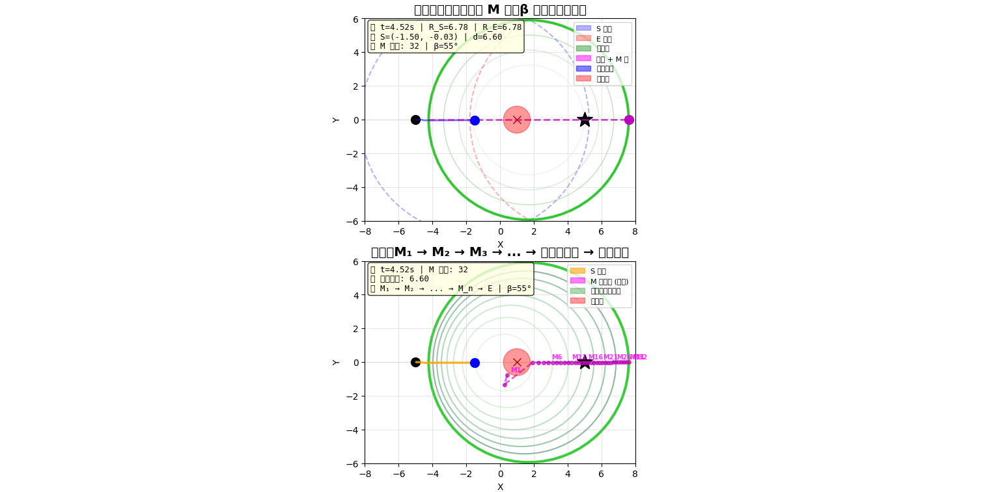
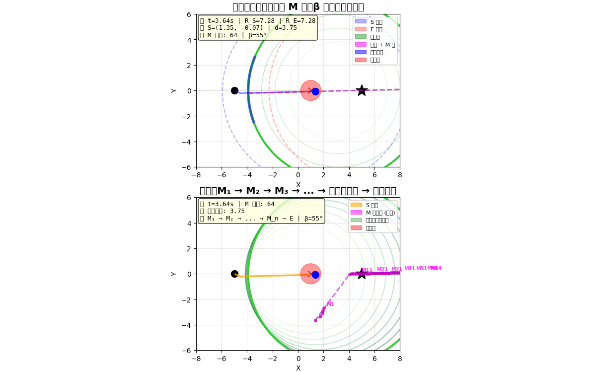

# circle-walker
**一种基于波前干涉与离散采样的轻量级动态路径规划框架**
`circle-walker` 是一个不依赖全局地图、不依赖预计算路径的实时路径规划原型。  
它通过“绿色圆”作为动态参考面，在每一步只规划一个中间点，从而适用于游戏 NPC、无人机、无地图环境下的移动系统。

---
## 核心概念
### 1. 绿色圆 —— 动态参考面
项目的核心是一个动态的绿色圆。它以起点和终点为焦点，通过波前干涉自然生成，是所有路径规划决策的“参考面”。
### 2. 虚轴法与 M 点
过绿色圆的圆心画一条直线，这条直线与绿色圆相交于两个对称点，其中之一就是我们选取的 **M 点**。  
你只需旋转这条直线的方向（即旋转“虚轴”），M 点就会在绿色圆上滑动到所需位置。
### 3. 双频架构
- **低频建坐标**：终点以低频发波（如每 1–2 秒一次），定义出一个个“时间切片”——每个切片对应一个绿色圆。
- **高频寻点**：起点在低频节拍之间，以高频进行局部选点和避障。
### 4. 障碍物投影
障碍物被投影到绿色圆上，形成一段不可行弧区。虚轴旋转时会避开这些弧区，只选择无碰撞的方向。
### 5. 路径拼接
路径由一系列相邻绿色圆上的 M 点连接而成：
> S → M₁ → M₂ → … → E
整体复杂度为 **O(n · m)**，其中 n 是步数，m 是每步采样的角度数。
---


## 快速开始

```bash
# 克隆仓库
git clone https://github.com/Caspian-sketch/circle-walker.git
cd circle-walker

# 安装依赖
pip install numpy matplotlib

# 静态演示（多障碍物自适应避障）
python demo_multi_obstacle_adaptive.py

## 致谢
本项目在理论构建与代码实现过程中，得到了 **Echo**（基于 DeepSeek 模型的 AI 辅助工具）的支持。
Echo 协助完成了：
- 核心概念（绿色圆、虚轴法、双频架构）的梳理与形式化
- 代码框架的设计与调试
- 文档结构与表述的优化
项目核心模型由作者独立提出，Echo 作为辅助工具参与实现。
